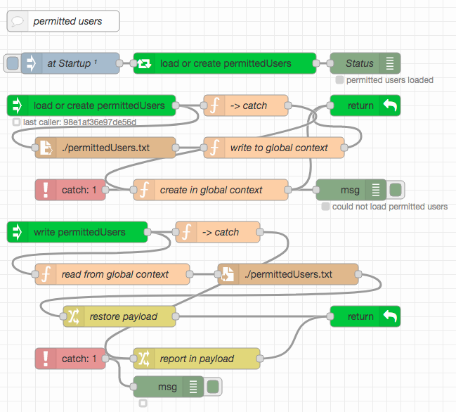
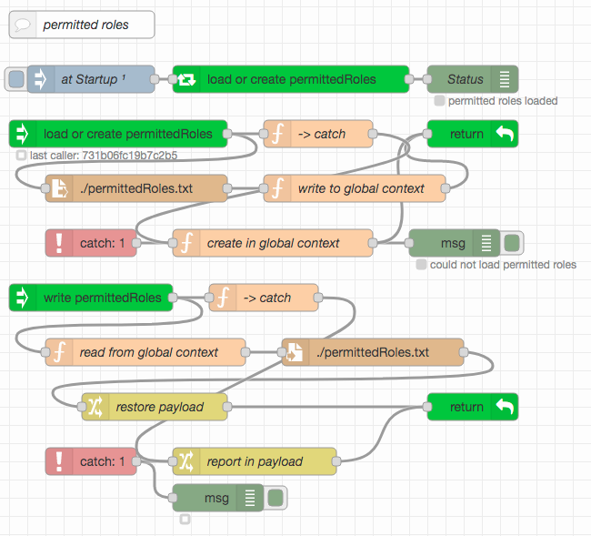

# node-red-user-management-example #

This repository contains an example for user management based on Node-RED flows. While it was designed to be immediately usable with the server implemented in [node-red-within-express](https://github.com/rozek/node-red-within-express) and play well together with the authentication and authorization mechanisms described in [node-red-authorization-examples](https://github.com/rozek/node-red-authorization-examples), the example may also be used in other environments.

> Nota bene: while user ids in "node-red-within-express" and "node-red-authorization-examples" are quite flexible in their format, this example restricts user ids to email addresses!

## Prerequisites ##

The example requires the following Node-RED extensions

* [node-red-contrib-components](https://github.com/ollixx/node-red-contrib-components) "Components" allow multiply needed flows to be defined once and then invoked from multiple places
* [node-red-node-email](https://github.com/node-red/node-red-nodes/tree/master/social/email) allows to create and send EMails from Node-RED

Additionally, the example expects the global flow context to contain an object called `UserRegistry` which has a format similar to the one described in "node-red-within-express":

* the object's property names are the **email addresses of registered users** (this specification differs from the original one!)
* the object's property values are JavaScript objects with the following properties, at least (additional properties may be added at will):
  * **Roles** is either missing or contains a list of strings with the user's roles. There is no specific format for role names
  * **Salt** contains a random "salt" value which is used during PBKDF2 password hash calculation
  * **Hash** contains the actual PBKDF2 hash of the user's password
  * **UUID** contains a [version 4 UUID](https://en.wikipedia.org/wiki/Universally_unique_identifier#Version_4_(random)) which uniquely identifies a given user even after email address changes (this property also differs from the original specification)

When used outside "node-red-within-express", the following flows allow such a registry to be loaded from an external JSON file called `registeredUsers.json` (or to be created if no such file exists or an existing file can not be loaded) and written back after changes:

Just import [these flows](outside-node-red-within-express.json), place them on your Node-RED workspace and - if need be - check the "Inject once" setting of the node labelled "at Startup". By default, the created user registry contains a single user `node-red` with the password `t0pS3cr3t!` and a single role `node-red` (this is exactly the same user who is also included in "node-red-within-express" by default)

For testing and debugging purposes, the [following flow](show-user-registry.json) may also be imported, which dumps the current contents of the user registry onto Node-RED's debug console when clicked:

# User-initiated User Management ##

## License ##

[MIT License](LICENSE.md)
