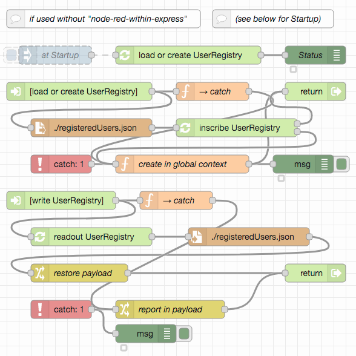
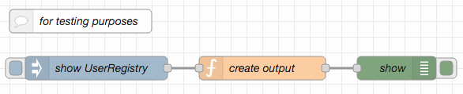

# node-red-user-management-example #

This repository contains an example for user management based on Node-RED flows. While it was designed to be immediately usable with the server implemented in [node-red-within-express](https://github.com/rozek/node-red-within-express) and play well together with the authentication and authorization mechanisms described in [node-red-authorization-examples](https://github.com/rozek/node-red-authorization-examples), the example may also be used in other environments.

> Nota bene: this example uses an extended format for the "User Registry" introduced in "node-red-within-express". If you plan to use it, please update your `registeredUsers.json` file accordingly and take the new user id format into account when accessing the Node-RED editor (e.g., `node-red@mail.de` instead of `node-red`)

> Nota bene: while this example already considers a few legal regulations, no guarantee can be given that these measures are correct and/or complete. **It is entirely your responsibility to offer a service which complies with the legal requirements!**

## Prerequisites ##

The example requires the following Node-RED extensions

* [node-red-contrib-components](https://github.com/ollixx/node-red-contrib-components) "Components" allow multiply needed flows to be defined once and then invoked from multiple places
* [node-red-node-email](https://github.com/node-red/node-red-nodes/tree/master/social/email) allows to create and send EMails from Node-RED

Additionally, the example expects the global flow context to contain an object called `UserRegistry` which has a format based on the one described in "node-red-within-express" but with a few extensions:

* the object's property names are the **email addresses of registered users** (this specification differs from the original one!)
* the object's property values are JavaScript objects with the following properties, at least (additional properties may be added at will):
  * **Roles** is either missing or contains a list of strings with the user's roles. There is no specific format for role names
  * **Salt** contains a random "salt" value which is used during PBKDF2 password hash calculation
  * **Hash** contains the actual PBKDF2 hash of the user's password
  * **UUID** contains a [version 4 UUID](https://en.wikipedia.org/wiki/Universally_unique_identifier#Version_4_(random)) which uniquely identifies a given user even after email address changes (this property has been added to the original specification). If you want to generate UUIDs for already existing users, this [online generator](https://www.uuidgenerator.net/version4) might be useful
  * **agreedToDPS** indicates that the user has read and agreed to this service's "Data Privacy Statement" and must be set to `true` for an account to get confirmed (this property has been added to the original specification)
  * **agreedToTOS** indicates that the user has read and agreed to this service's "Terms of Service" and must be set to `true` for an account to get confirmed (this property has been added to the original specification)

When used outside "node-red-within-express", the following flows allow such a registry to be loaded from an external JSON file called `registeredUsers.json` (or to be created if no such file exists or an existing file can not be loaded) and written back after changes:

Just import [these flows](outside-node-red-within-express.json), place them on your Node-RED workspace and - if need be - check the "Inject once" setting of the node labelled "at Startup". By default, the created user registry contains a single user `node-red@mail.de` with the password `t0pS3cr3t!` and a single role `node-red` (this is exactly the same user who is also included in "node-red-within-express" by default)

For testing and debugging purposes, the [following flow](show-user-registry.json) may also be imported, which dumps the current contents of the user registry onto Node-RED's debug console when clicked:

## Typical User Lifecycle ##

A typical user lifecycle looks as follows:

* **a new user gets registered** either by him/herself or by an administrator. In this implementation, new users who register themselves only have to specify their email address in order to start a registration. To limit the users who can register, a list of permitted email addresses may be provided
* **upon registration, an "account confirmation message" is sent** by email to the given address this email contains a link which, when clicked, should navigate to a web page (or web application) where the new user *may* add additional information (such as his/her real name, f.e.), *must* define a password for his/her account, *must* (read and) agree to a "Data Privacy Statement" and to some "Terms of Service" (for legal reasons) and then send that information back to the server in order to **confirm the account**. If such a confirmation does not happen within a certain period, the registration is automatically cancelled - until then, the given email address is reserved and no other account with the same address may be registered
* after successful account confirmation, **the user may "log-in"** and use the offered service while this implementation uses the "Header-based Authorization" described in [node-red-authorization-examples](https://github.com/rozek/node-red-authorization-examples) any of the other methods will work as well - but you will have to modify the flows in this repository accordingly
* while logged-in, a user may additionally
  * **change his/her email address** changing one's email address will actually start a confirmation process similar to that after an initial registration. As soon as the new email address is confirmed, the old one will be removed and the new one used from now on for the already existing account. Until then (or if the new address does not get confirmed in time) the old email address continues to work as usual
  * **change his/her password** changing one's password requires to specify the old password for authorization - if that password is fogotten, a "password reset" may be initiated (see below)
  * **change other account details** custom server implementations may need additional user information (such as a user's real name, his/her address, credit card details etc.) These details may be changed online as well - except the user's agreement to "Data Privacy Statement" and "Terms of Service" which may only be cleared)
* should a user have forgotten his/her password, he/she may **start a "password reset" process** as a consequence, a "password reset message" is sent by email to the user's address. This email contains a link which, when clicked, should navigate to a web page (or web application) where the user may define a new password without having to specify the current one
* last, but not least, every user may **delete his/her account** this action immediately removes the user's account and wipes out any data associated with this user

### User Administrators ###

While "normal" users may only inspect and affect their own accounts, User Administrators (i.e., users with the role `user-admin`) may also manage the accounts of other people. In particular, they may

* **change other user's email addresses** although the new addresses will also have to be confirmed in the same way as if the users would have initiated the change themselves
* **change other user's roles** this function is only available to user administrators
* **inspect or change other user's account details** any detail may be changed except email addresses, passwords, `Salt` and `Hash` values or the agreement to "Data Privacy Statement" or "Terms of Service" (which may only be cleared)
* **delete other users**

But even User Administrators neither have access to other user's passwords nor can they change other user's agreement to the service's "Data Privacy Statement" and "Terms of Service"

### "Data Privacy Statement" and "Terms of Service" ###

> Nota bene: the legal documents mentioned above (i.e., "Data Privacy Statement" and "Terms of Service") are not part of this user management implementation but have to be provided separately

Should "Data Privacy Statement" and/or "Terms of Service" change, properties `agreedToDPS` and/or `agreedToTOS` may be set to `false` again. In that case, any new login should immediately redirect the user to a separate web document where he/she may either (read the changed documents) and agree again or delete his/her account. Without such an agreement, the user should no longer be allowed to access the service and logged out immediately.

## License ##

[MIT License](LICENSE.md)
